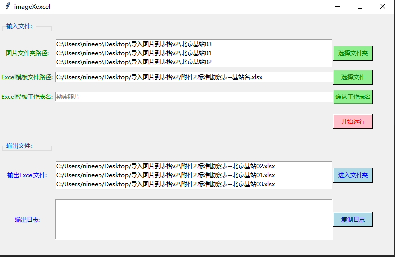

## Feture 
### 将图片批量插入excel表格  

## Usage
### 环境要求：Windows + python3.7 

#### cli
    # 安装依赖lib
    pip install -r requirement.txt
    
    # 运行服务
    python3 imageXexcel.py
    
#### windows exe
[**zip文件下载**](https://github.com/nineep/imageXexcel/releases)
    
    # 安装依赖lib
    pip install -r requirement.txt

    # 安装pyinstaller 
    pip install pyinstaller
    
    # 打exe包
    pyinstaller imageXexcel.spec
    
    # 打包生成exe文件和配置文件会存放在imageXexcel目录
    # 并且生成imageXexcel.zip文件
